# Laporan Praktikum Basis Data - Pertemuan 1

**Nama:** Vicky Pradana  
**NIM:** 25430047  
**Kelas:** B  
**pertemuan:** 01
**Tanggal:** 1 Oktober 2026
**Nama Dosen:** Dedi Irawan, S.Kom., M.T.I.

## 1. Tujuan Praktikum

setelah menyelasaikan modul ini ,mahasiswa mampu:
1.menjalankan dan mematikan mariadb lewat xampp serta memahami status dan portnya.
2.mengakses mariadb lewat cli dan phpmyadmin serta memahami perbedaannya.
3.mengamankan akun root dan membuat akun dengan hak akses terbatas.
4.membuat database pertama dan mencatatnya ke repositori git yang terhubung dengan github.

## 2. Ringkasan Dasar Teori

### ringkasan dasar teori

basis data itu kumpulan dari yang saling terhubung terus di simpen teratur agar mudah digunakan dan dikelolah bassi data bisa digunakan oleh beberapa pengguna atau apk secara langsung.yang ngolah basis adalah database manegement sistem (dbms) ,perangkat lunak yg mengatur menyimpan , mengolah, dan akses data.

mariadb pake arsitektur klein server jadi ada dua bisa pake CLi mysql yg jalan di coment prompt atau pake web phpmyadmin
lalu meraka akan menghasilkan atau pesan galat.

xampp adalah paket gratisan yg memberikan beberapa komponen yang gabungkan server web apache,server basisdata mariadb,bahasa php, dan apk phpmyadmin dalam satu paket instalasi

ada perbedaan kolo mau pake cli mariadb dan web phpmyadmin
perbedaannya ada kolo di cli bentuknya teks di coment prompt kolo di phpmyadmin dia pakai web(localhost/phpmyadmin/ ),pesan galat juga berbeda di cli lengkap ada kode,SQLSTATE,teks kolo di web phpmyadmin lengkapan tapi bisa terkadang terselip di antara eleman tampilan

git di pake untuk mencatat dan mengelola perubahan pada file melalui commit. alur kerja git biasanya dari working directory, staging area, repository lokal, dan repository jarak jauh seperti github. perubahan file dimasukkan ke staging area dengan `git add`, disimpan ke repository lokal dengan `git commit`, lalu dikirim ke github menggunakan `git push`.

## 3. Hasil Langkah Percobaan

### D.1 Menjalankan Layanan MariaDB

pertama buka xampp dengan menjalankannya pake run adminitration
terus klik star mysql tunggu bentar nanti ada warna ijo berarti berhasil
dimana masok ke port 3306
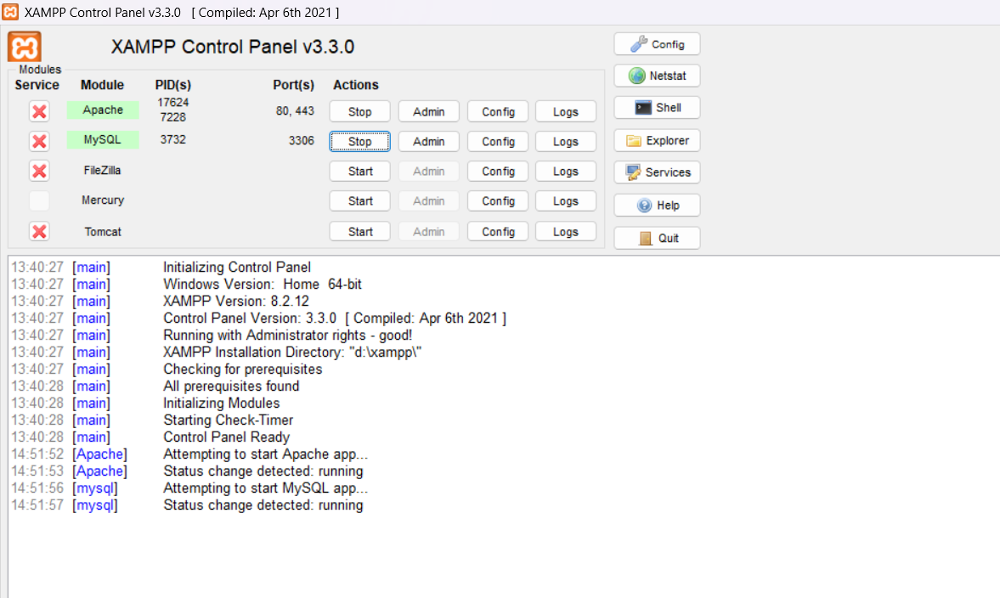
**keteranagan** mariadb berhasil dijalankan di laptod

### D.2 Masuk Melalui Klien cli

masuk ke sell di xamppp
di coment prompt bisa ketik myqsl -u root
ketik SELECT VERSION(), CURRENT_USER();
SHOW DATABASES;
SELECT @@sql_mode;
nanti biasanya akan muncul sql_mode=NO_ZERO_IN_DATE,NO_ZERO_DATE,NO_ENGINE_SUBSTITUTION
yang sudah benar ini sql_mode=STRICT_TRANS_TABLES,ERROR_FOR_DIVISION_BY_ZERO,NO_AUTO_CREATE_USER,NO_ENGINE_SUBSTITUTION

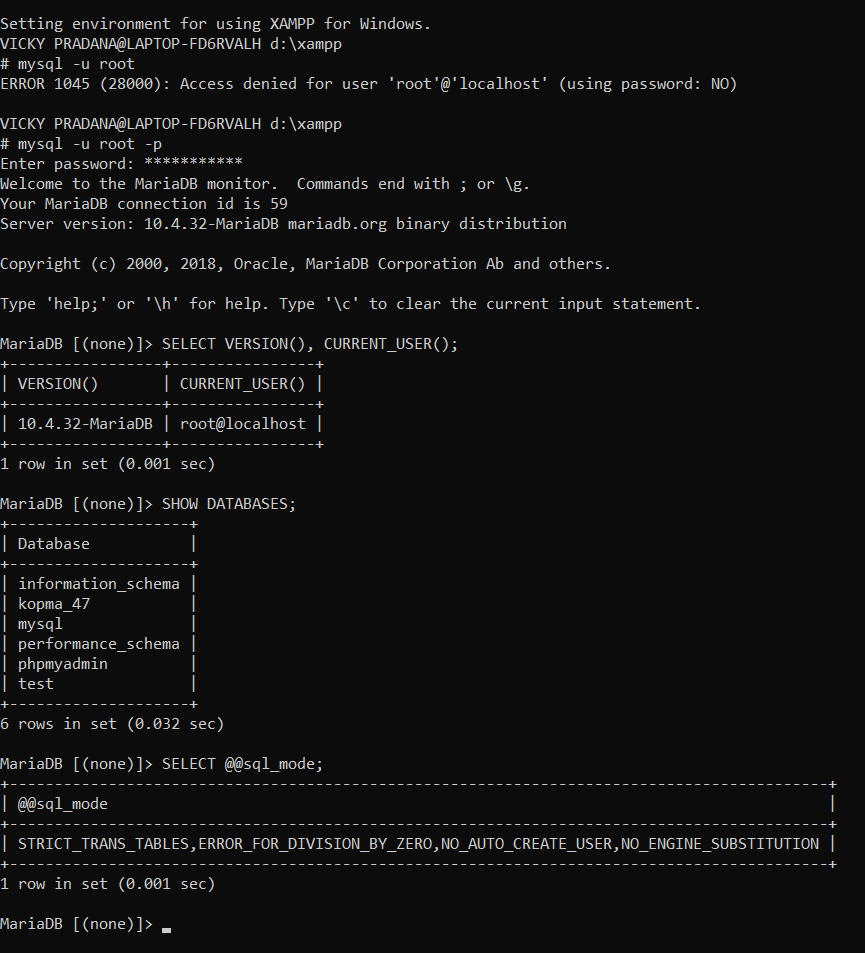
**keteranagan** masuk ke cli mariadb berhubung sudah pernah masuk dan buat pasword jadinya masuk dengan pasword

### D.3 bikin akun root

kan sudah masuk ke mysql -u root
ketik ini langsung SELECT User, Host FROM mysql.user WHERE User = 'root';
terus akan muncul 3 yaitu localhost, 127.0.0.1, dan
::1.
buat pw
ALTER USER 'root'@'localhost' IDENTIFIED BY 'buat pw baseng';
ALTER USER 'root'@'127.0.0.1' IDENTIFIED BY 'buat pw baseng';
ALTER USER 'root'@'::1' IDENTIFIED BY 'buat pw baseng';
tiap baris atau saf akan muncul Query OK
dan ketiganya harus sama tidak boleh beda
lalu exit dan masuk lagi pake mysql -u root -p
nanti akan dimanintakan pw dan masukan

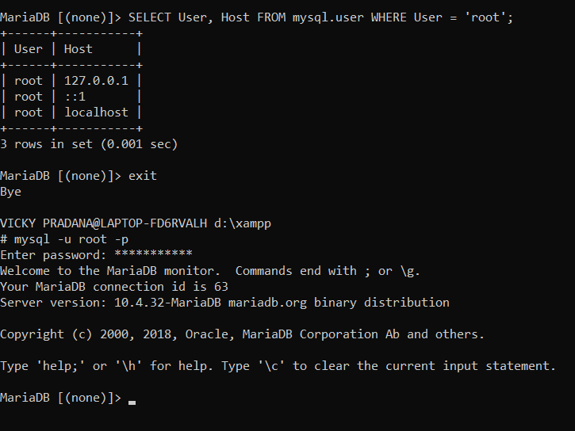
**keteranagan**

### D.4 bikin barisdata dan akun kerja

sudah masuk ke mysql -u root -p lalu
ketik ini
CREATE DATABASE kopma_123
CHARACTER SET utf8mb4 COLLATE utf8mb4_unicode_ci;

CREATE USER 'mhs*123'@'localhost' IDENTIFIED BY 'PasswordKerja#123';
GRANT ALL PRIVILEGES ON kopma_123.\* TO 'mhs_123'@'localhost';
SHOW GRANTS FOR 'mhs_123'@'localhost';
yang ada 123 ganti pake ujung nmp anda
jika sudah exit masuk lagi
mysql -u mhs*<ujung nmpmu> -p
lalu ketik
SHOW DATABASES;
USE mysql;

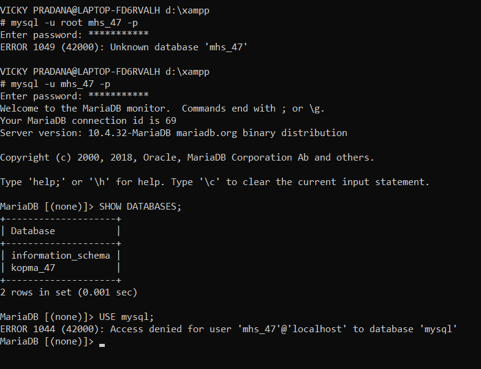
**keteranagan**berhubung sudah buat akun kerja jadi langsung ke hasil

### D.5 pake phpmyadmin

buka folder xampp/phpmyadmin di vs code bisa atau alat editor lain
cari file namanya config.inc.php
terus edit di baris $cfg['Servers'][$i]['auth_type'] = 'config';
ganti config jadi cookie terus ctrl + s
terus buka web phpmyadmin http://localhost/phpmyadmin
masuk pake mhs_123 klik sql terus jalankan yang sma ke di cli

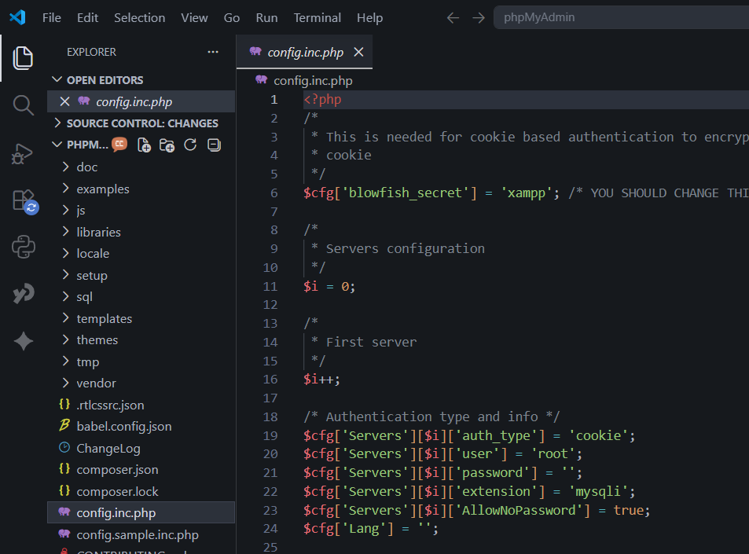
**keteranagan**ganti config jadi cookie

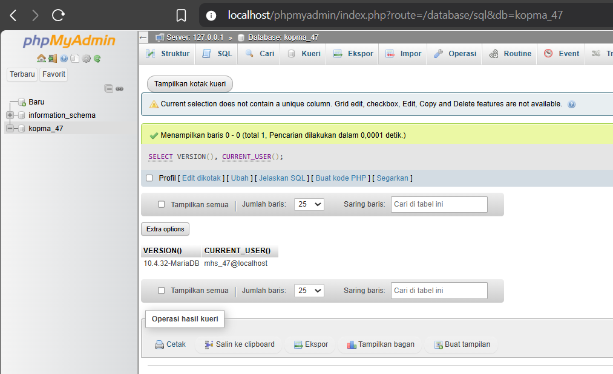
**keteranagan**web phpmyadmin

### D.6 bikin basisdata dan akun kerja

buka vscode aja buat folder seperti ini D:\praktikum\basisdata-25430047
terus buat dua
file: README.md (identitas: nama, NIM, kelas) dan
p01*lingkungan*<NIM>.sql
Isi file SQL dengan perintah yang di jalankan hari ini
terus Inisialisasi repositori, commit, lalu kirim ke GitHub
caranya buka di coment propt
cd /d D:\praktikum\basisdata-25430047
terus ketik ini perbaris
git init
git add README.md p01_lingkungan_2301010123.sql
git commit -m "p01: inisialisasi repositori dan skrip lingkungan"
git remote add origin https://github.com/<akun>/basisdata-
2301010123.git
git push -u origin main

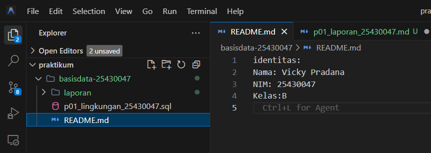
**keteranagan** identitas

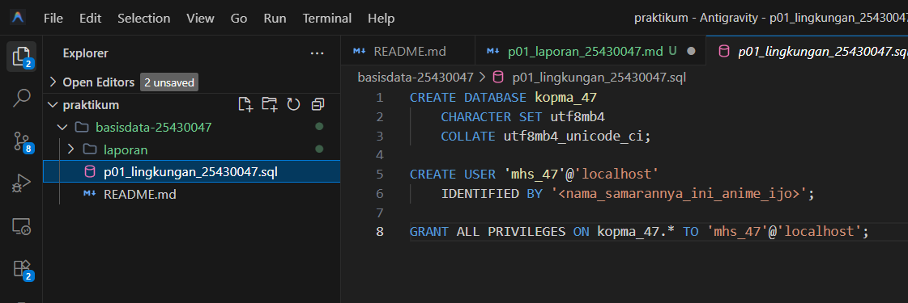
**keteranagan** yang perintah yang kita jalankan

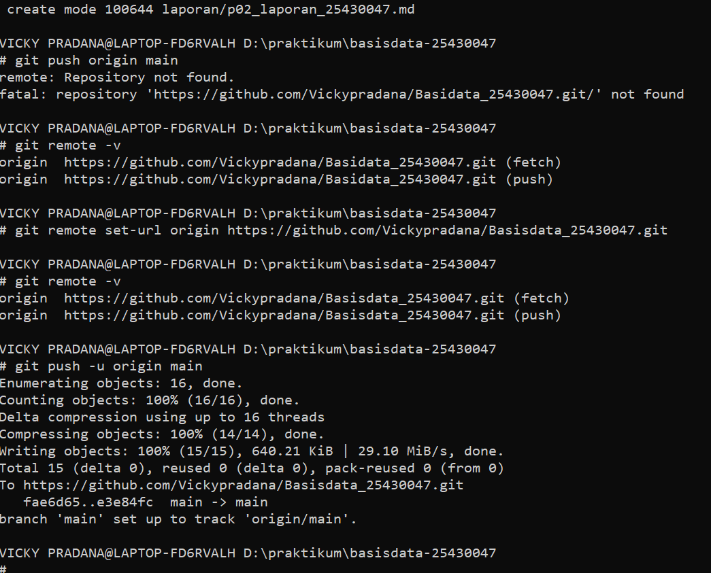
**keteranagan** bukti sudah di repositiri

## 4. Jawaban Titik Analisis

### Titik Analisis 1

Label tombol bertuliskan “MySQL”, tetapi yang berjalan adalah MariaDB. Apa
konsekuensinya ketika Anda mencari solusi galat di internet? Kapan dokumentasi MySQL
masih relevan, dan kapan Anda harus merujuk ke dokumentasi MariaDB?
pertama kenapa tombol mysql di tapi yg jalan mariadb karena di xampp mysql menggatikan myslq untuk database server
kedua cari galat di internet itu harus teliti pada sumber solusinya dan tidak semua solusi mysql cocok dengan mariadb, solui kusus mysql bisa saja berbeda atau tidak berlaku pd mariadb
ketiga kapan masil relevan ketika konsep dan sintaks SQL yang umum masih kompatibel, seperti SELECT, INSERT, UPDATE, DELETE, dan CREATE TABLE dengan mariadb
kapan harus di rujuk ketika pas membahas fitur,konfigurasi atau perilaku yang kusus pd mariadb

### Titik Analisis 2

Keluar lagi, lalu coba masuk dengan mysql -u root tanpa -p. Catat pesan galat yang
muncul. Bagian mana dari pesan itu yang memberi tahu bahwa klien tidak mengirim
password? Bandingkan jawaban Anda dengan Gambar 1.10 di bagian Troubleshooting.
ini pesan galatnya
ERROR 1045 (28000): Access denied for user 'root'@'localhost' (using password: NO)
bagian yg kasih tau bahwa klien tidak kirm -p adalah error 1045 (28000): access deniad
pesan error punya saya dan gambar 1.10 sama

### Titik Analisis 3

Mengapa information_schema tetap terlihat oleh mhs_123, sedangkan mysql
ditolak dengan ERROR 1044? Apa bedanya kode galat 1044 dengan 1045?
kenapa information_schema terliat karena itu basis data yg informasinya bisa di liat pengguna,
mysql ketolak karena mhs-123 tidak memiliki hak akses ke basisdata mysql ketika mengetikan USE mysql;
beda kode 1044 dan 1045 itu
1044:penggunya masuk tapi gk ada hak akses
1045:pengguna gagal masuk pas login bisa salah di username atau pw

### Titik Analisis 4

Mode cookie meminta pengguna mengetik password setiap kali masuk. Mengapa mode
ini lebih aman daripada mode config yang menyimpan password di dalam berkas
konfigurasi?
lebih aman karena pw tidak di simpen di konfigurasi jadi tidak ketahuan kolo berkas konfigurasi di akses orang lain

## 5. Hasil Latihan dan Modifikasi

### E.1 nguji hak akses akun tamu_47

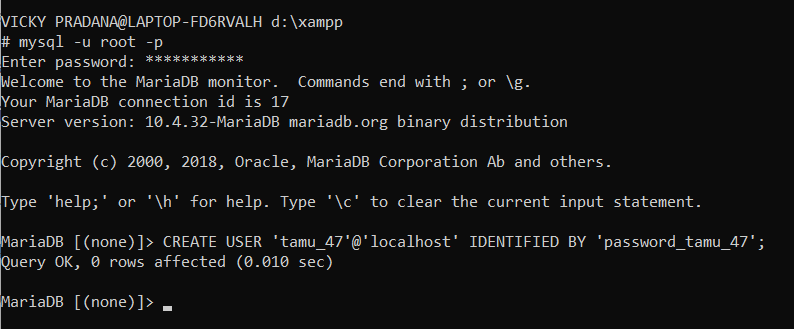

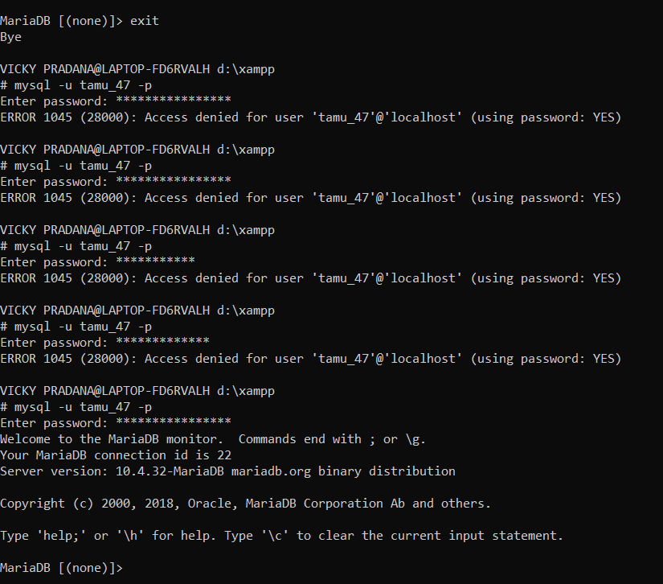

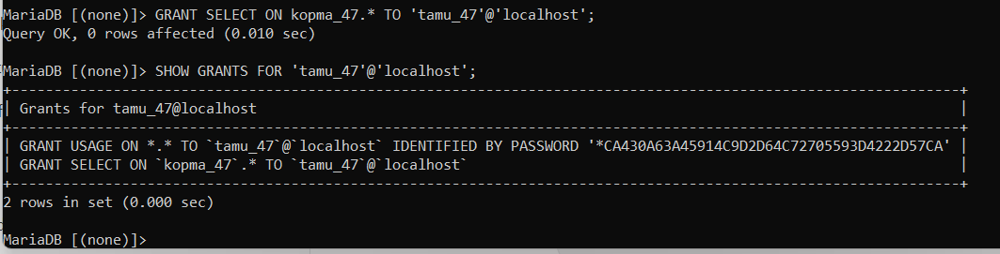

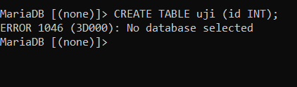
penjelasan error 1046: perintah gagal karena blm ada database yg dipilih

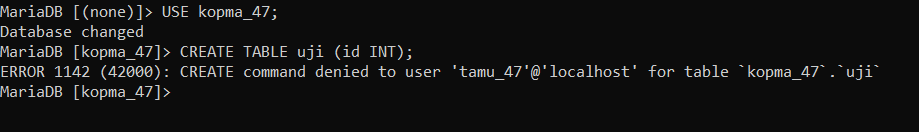
penjelasan error 1142: akun tamu_47 todak ada hak create pd database kopma_47

### E.2 modifikasi scrip agar dapat berulang kali

Jadi script untuk yang ini, yang udah dimodifikasi, ditambahin dengan if not exists pada perintah database, create user, pas dijalankan, berhasil tanpa ada masalah dan tanpa menghasilkan tanpa pesan galat.

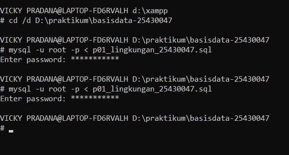

## 6. Tugas Mandiri: Milestone Proyek 1

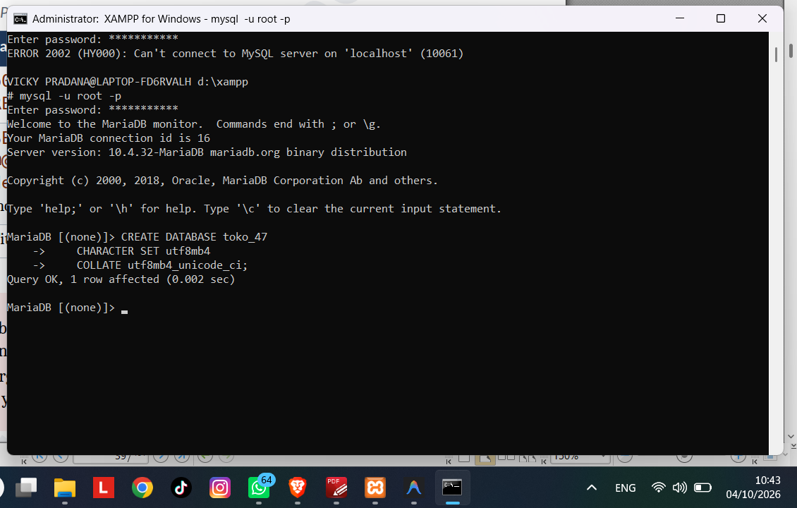

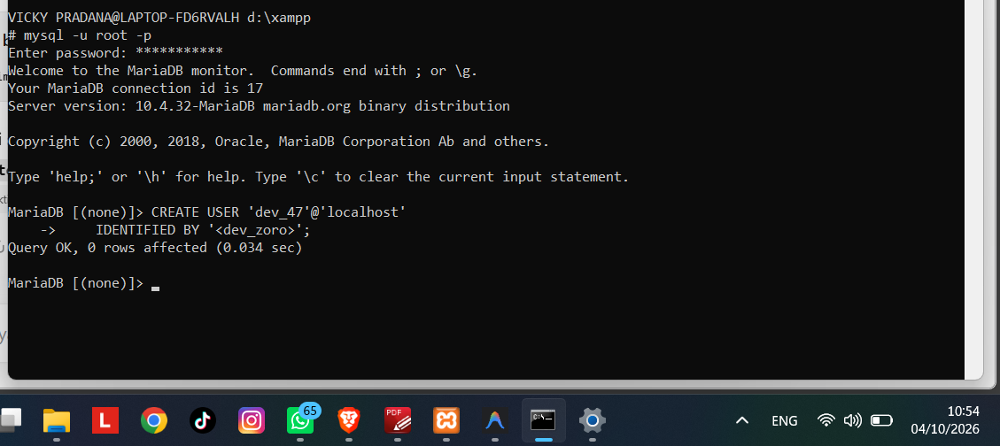

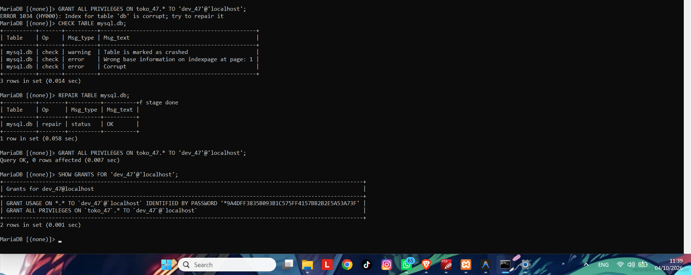
**keterangan** beri hak akses dev_47 ke toko_47

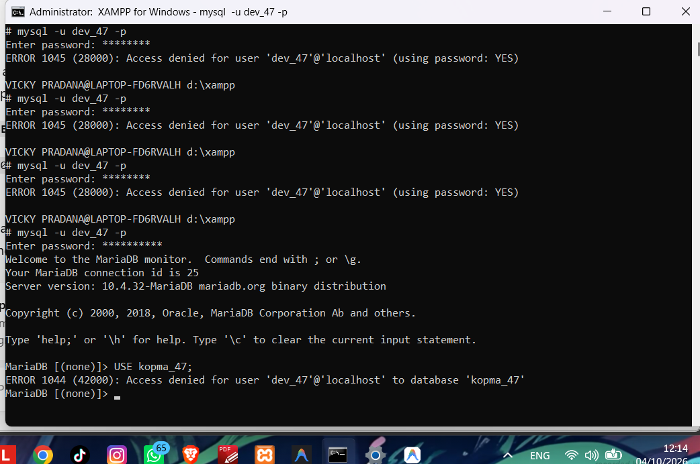

## 7. Pembahasan dan Kendala

## 8. Kesimpulan

## 9. Pernyataan Penggunaan AI

Di sini saya menyatakan bahwa penggunaan AI memang terjadi pada laporan ini, di mana pada laporan ini hanya menggunakan template yang strukturnya itu tidak juga sama sekali, cuman ditambahkan beberapa keterangan-keterangan singkat di setiap struktur laporan. Nah jadi misal di bagian teori, singkat teori singkat itu dikasih space buat kita mengetik yang mau kita ketik. Terus di bagian percobaan, di D, itu cuma dibagi tempat buat mengetik langsung. Jadi sudah ada yang namanya D1, D2, D3, D4, D5, dan D6. Jadi tinggal mengetik di situ tempatnya. Terus pada laporan ini saya menggunakan AI juga untuk memperbaiki kesalahan atau error yang terjadi ketika percobaan atau tugas proyek dan latihan. Jadi menggunakan AI untuk terkait dengan mencari solusi kenapa ini terjadinya error pada pelaksanaan latihan, latihan-latihan.

## 10. Bukti Git

**Repository:**

**Commit:**

## Checklist

- [ ] D.1–D.6 selesai
- [ ] Titik Analisis 1–4 dijawab
- [ ] E.1–E.2 selesai
- [ ] Milestone Proyek 1 selesai
- [ ] Bukti screenshot lengkap
- [ ] Git commit dan push
