# Laporan Praktikum Basis Data - Pertemuan 02

**Nama:** Vicky Pradana  
**NIM:** 25430047  
**Kelas:** B  
**Tanggal:** 05 oktober 2026
**Nama Dosen:** Dedi Irawan, S.Kom., M.T.I.

## 1. Tujuan Praktikum
sebenarnya kita ini, apa, dapat sebuah studi kasus atau aktivitas suatu organisasi lah. Jadi di mana kita itu bisa menganalisis namanya organisasi, ada aktor, bisnis, proses bisnis, dan lain-lain. Dan kita juga bisa menyusun suatu tabel yang berupa yang namanya proses data matriks bernama CRUD

## 2. Ringkasan Dasar Teori
Kita mampu, apa namanya, menganalisis suatu, suatu perpanjangan basis data lah mungkin ya, di mana kita itu harus paham data apa yang lahir dari aktivitas itu. Terus kita juga harus paham untuk namanya data sebagai aset organisasi. Jadi gunanya adalah untuk tata kelola suatu data dalam organisasi yang dapat diatur dengan baik, ada penanggung jawabnya. Terus kita ada sumber kebutuhan dan jenis kebutuhan juga sih. Kita nyari sumbernya itu dari mana? Misal dari nota atau formulir atau yang lain. Habis itu, habis itu dari sumber itu dikelompokin. Dan kita juga harus buat namanya matrix CRUD. yaitu, prototype itu C sama dengan Create, R sama dengan Read, U atau Update, dan D dengan Delete. Oh ya, sama ini kamu catat, kita butuh kamus data Gunanya untuk mendokumentasikan setiap elemen data yang ada. Dah, itu doang

## 3. Hasil Langkah Percobaan
### D.1 Membaca Studi Kasus

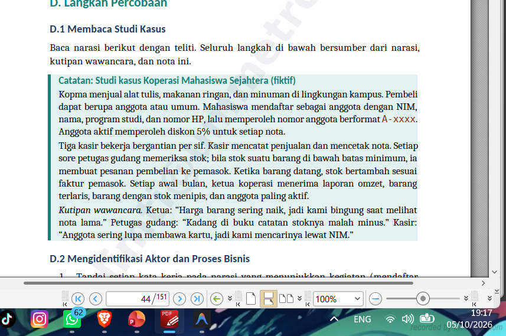

dalam studi kasus ini kopma untuk memahami aktivitas
organisasi, aktor yang terlibat, pengolahan data yg bermasalah

### D.2 Memetakan Aktor dan Aktivitas

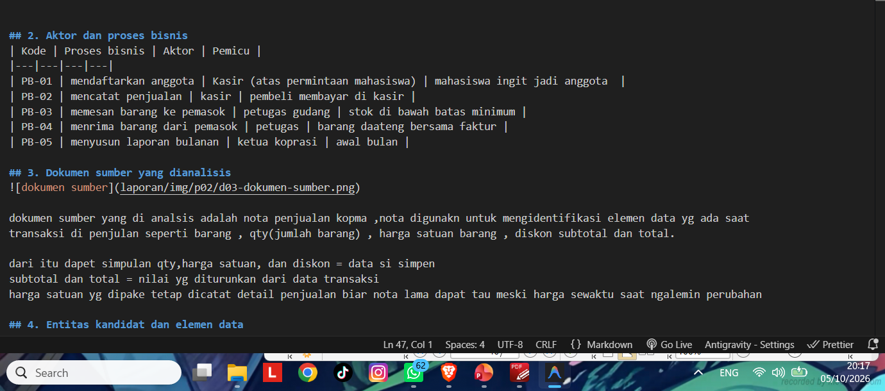

berhasil pemetaan proses bisnis, aktor terlibat,
serta pemicu dari setiap aktivitas

### D.3 Membedah Dokumen Sumber

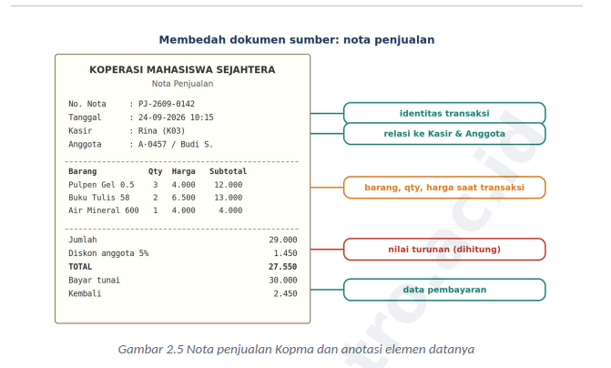

dokuen sumber ini nota penjualan Kopma , nota ini
diidentifikasi elemen data seperti barang, qty, harga satuan, diskon, subtotal,
dan total. Qty, harga satuan, dan diskon  data yang disimpan,
sedangkan subtotal dan total dihitung dari data transaksi

### D.4 Menurunkan Entitas Kandidat dan Aturan Bisnis

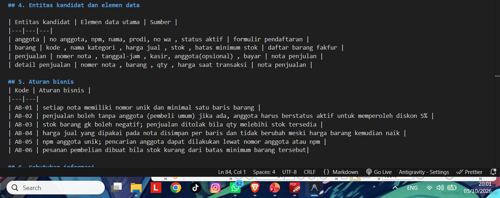

ditentukan kandidat entitas yang dibutuhkan mengolah
data Kopma serta aturan bisnis yang harus dipenuhi. Aturan bisnis diberi kode
AB-01 sampe AB-06

### D.5 Kebutuhan Informasi dan Matriks CRUD

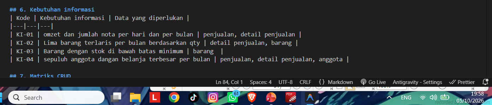

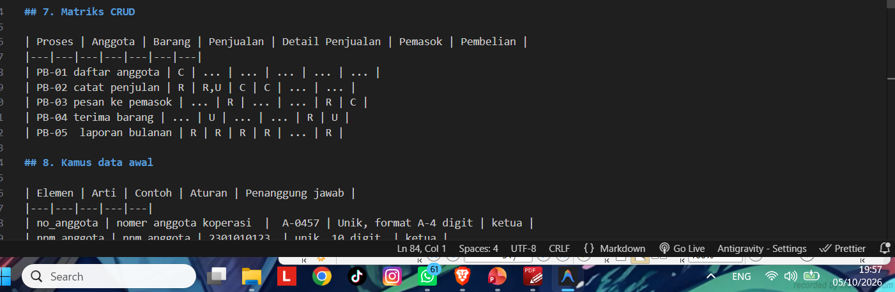

kebutuhan informasi yg harus dapat dihasilkan
oleh sistem serta pemetaan operasi Create, Read, Update, dan Delete pada
setiap proses bisnis

### D.6 Kamus Data Awal dan Kebutuhan Non-Fungsional

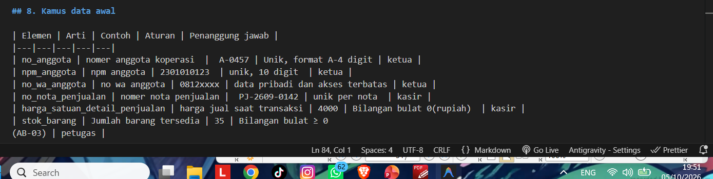

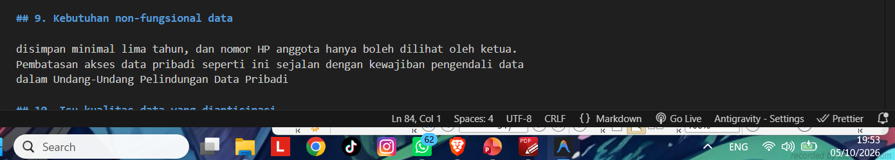

Kamus data dipake untuk jelaskan elemen data, arti, contoh, aturan,
dan penanggung jawab. Kebutuhan non-fungsional ada volume data,
retensi penyimpanan, dan pembatasan akses data pribadi.
### D.7 Menulis Dokumen Kebutuhan Data

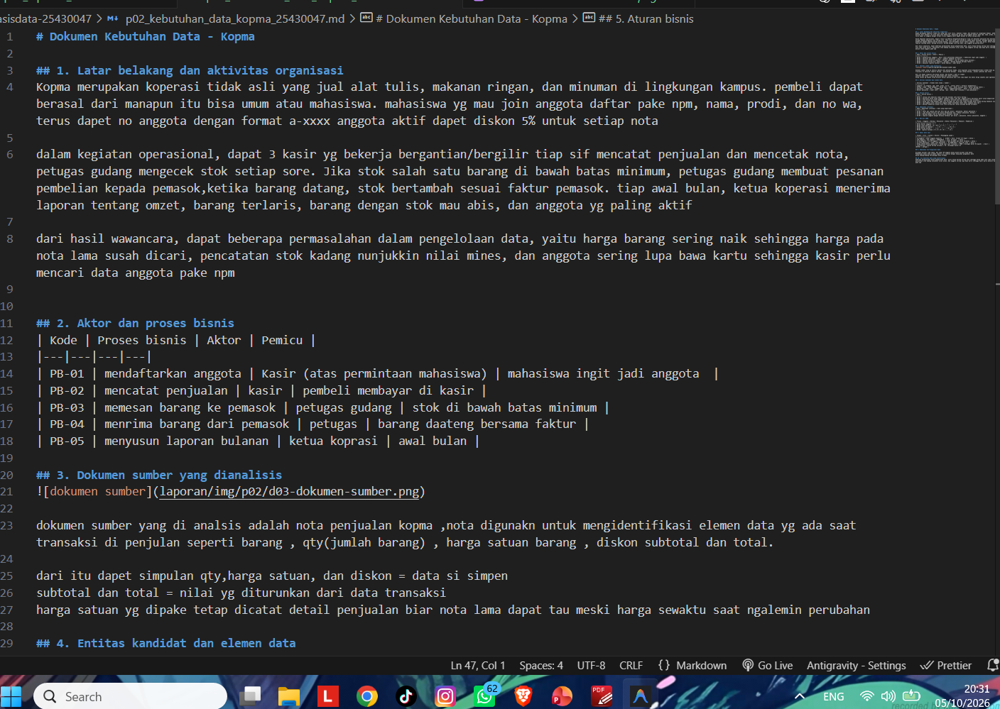

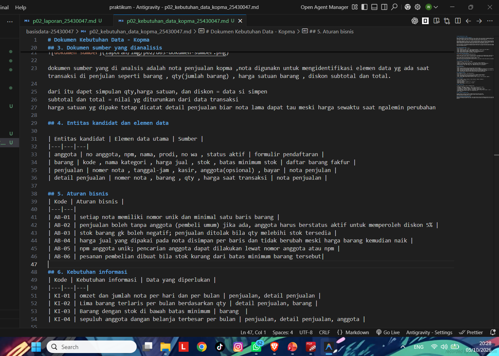

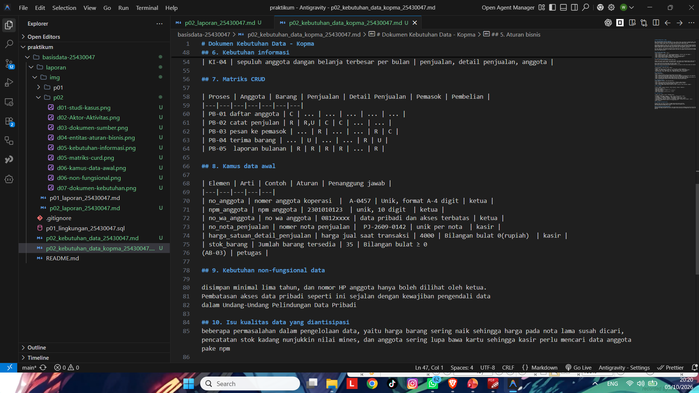

hasil pembuatan d.1 sampai d.6 dll, dengan nama file p02_kebutuhan_data_kopma_25430047.md
## 4. Jawaban Titik Analisis

Titik Analisis 1
Harga barang sudah tersimpan di data barang. Mengapa nota tetap perlu menyimpan 
harga saat transaksi? Hubungkan jawaban Anda dengan keluhan ketua koperasi dalam 
kutipan wawancara.

kenapa jika harga nya berubah dan hanya ngandelin harga yg ke simpen pada data barang  dan  harga yg lama dapat ngikutin harga haraga baru  maka ketuankoporasi akan kesulitan liat nota lama ketika harga barang naik

Titik Analisis 2
Subtotal dan total adalah nilai turunan. Sebutkan satu alasan untuk tidak menyimpannya 
dan satu alasan yang mungkin membuat total tetap disimpan. Keputusan akhirnya akan 
dibahas di Modul 4.

gk usaha disimpen karana itu turunan yang bisa di itung kembali pake data jumlah barang, harga saat transaksi dan diskon
disimpen jika mau dimudahkan mempercepat pencatatan dalam mempermudah dalam nilai transaksi di laporan

Titik Analisis 3
Perhatikan kolom Pemasok. Tidak ada proses yang memberi huruf C. Apa artinya, dan 
proses apa yang perlu ditambahkan ke daftar proses bisnis? Periksa juga: siapa yang 
mengubah status aktif anggota?

artinya ada terdapat proses yang belum di tercantum dalam daftar proses bisnis
proses yg di tambahkan itu mengolah data pemasok biar bisa di buat dan di rawat

## 5. Hasil Latihan dan Modifikasi

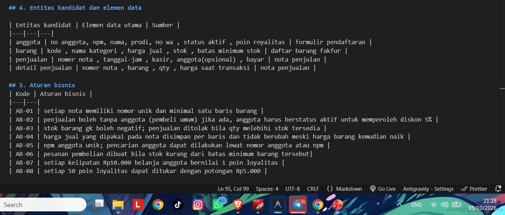
**keterangan** nambahin poin royalitas di entitas, aturan bisnis nambahin 2 saf baru aturan 

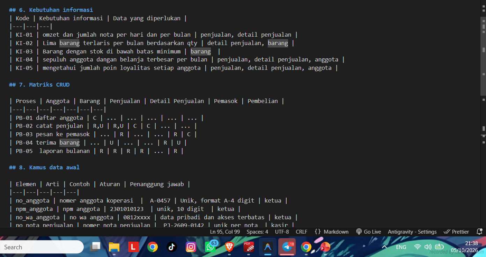
**keterangan** nambahin saf baru KI-05 

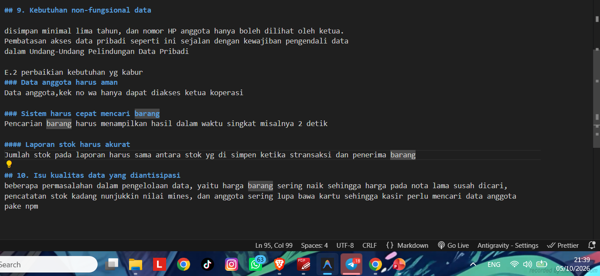
**keterangan** cuma perbaiki data yg kabur

## 6. Tugas Mandiri: Milestone Proyek 2

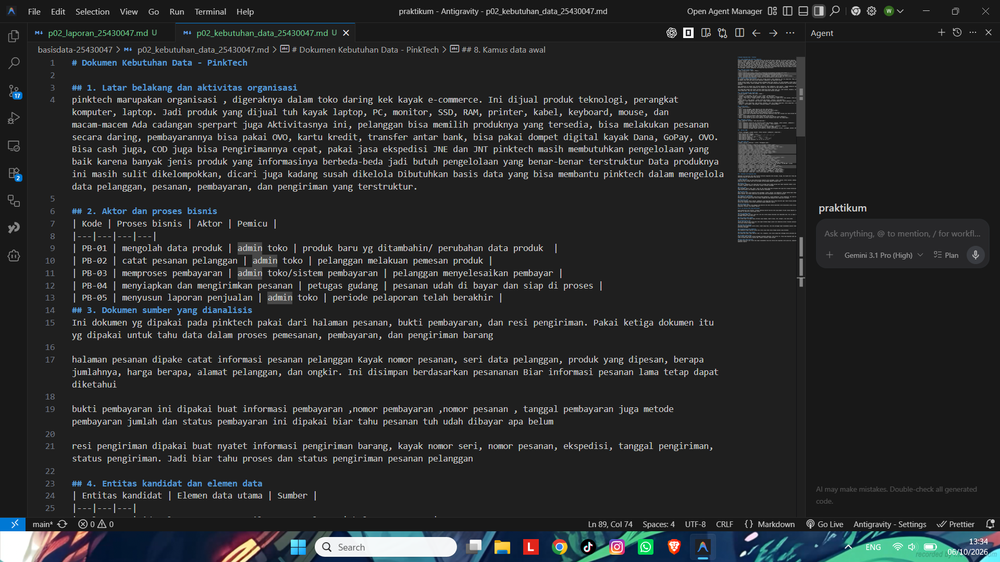
**keterangan** sudah ada minimal 4 proses bisnis

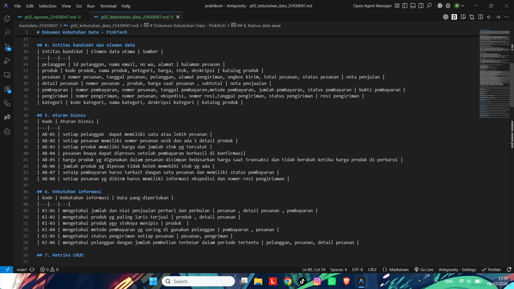
**keterangan** ada 6 entitas , ada 8 aturan bisnis dan 5 kebutuhan informasi

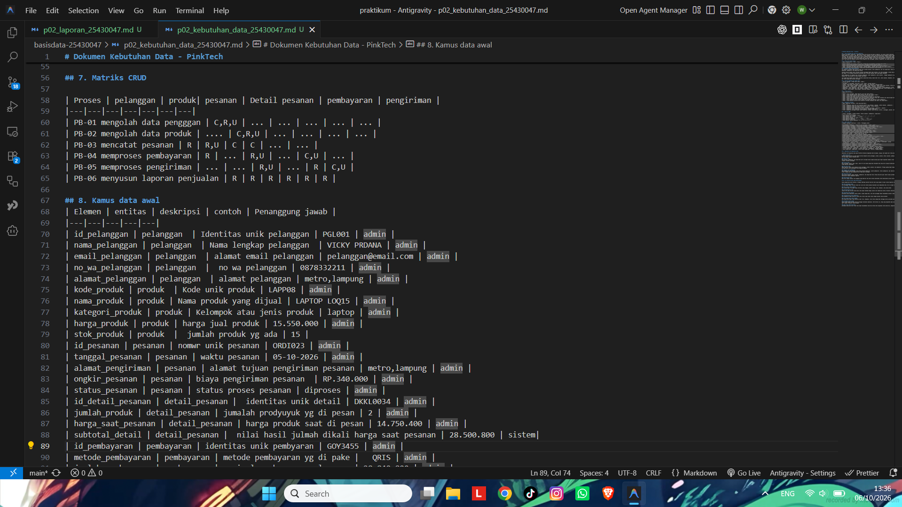
**keterangan** sudadah ada tabel matrik crud dan kaums data awal 27 eleman

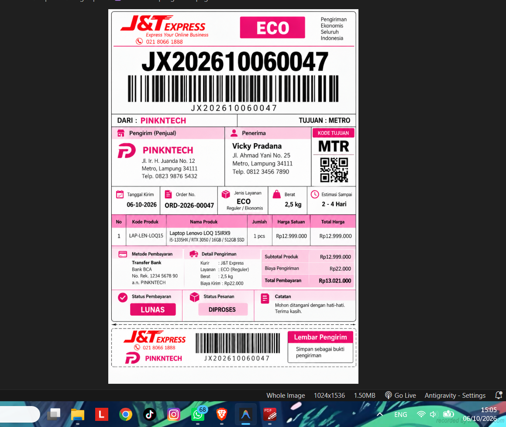
**keterangan** di buat dari menyesualikan toko daring gua yaitu pinktech toko daring kek leptop

## 7. Pembahasan dan Kendala
Sejauh ini untuk kendala yang dihadapi, pertama saya kurang paham di menu dua itu suruh ngapain. Terus setelah berbincang-bincang dengan tiga kawan saya, dengan empat kepala termasuk saya, akhirnya saya paham disuruh ngapain Terus di bagian proyek, di bagian proyek saya sedikit kurang paham, disuruh ngapa Ternyata disuruh kita membuat tabel dengan struktur kerangka yang sudah ada, yang ditentukan dalam buku. Itu kita bikin file baru dengan nama kebutuhan data. Udah seperti itu aja.

## 8. Kesimpulan
Di sini kita disuruh yang namanya membuat dua tabel data dari salah satu kasus. Terus dari kasus tersebut kita analisis, terus kita buat. Setelah kita bagi-bagi analisisnya itu kita bisa menentukan aktor, aktivitas, itu pembedaan dokumen atau ada dokumennya kan. Itu kita beda. Lalu ada namanya itu, kita mencari entitas-entitas atau mengecek aturan bisnis apa aja. Itu dibentukin kebutuhan informasi sama bikin matriks CRUD. Lalu kita cari, kita susun kamus data awal dan kebutuhan non-fungsional apa aja. Lalu kita bikin, apa ya, kita bikin, buat kerjakan, jelaskan titik-titik analisis yang udah dikasih. Jadi intinya cuma buat tabel, ada kasus, kita bikin beberapa tabel, kita analisis dari kasus itu dan dibuat beberapa tabel

## 9. Pernyataan Penggunaan AI
Di sini saya menyatakan bahwa penggunaan AI terjadi pada laporan ini. di laporan ini saya menggunakan yang digunakan itu pada template laporan. itu pakai template itu dibikin sama dia, tapi tetap ngikutin dari buku panduannya itu. Terus pada bagian tiga, hasil angka perjoban itu menggunakan AI, karena sedikit bingung tabelnya, tapi tetap kita ngerti manual. Jadi di saat D6 sampai D7 lah. lanjut di bagian titik analisis. Itu penggunaannya di bagian mencari tahu jawaban, tapi untuk jawabannya saya ketik sendiri. Lanjut di bagian tugas standar itu, ya, saya menggunakan AI. apalagi paling kelihatan di bagian gambar, spesi fiktif yang dibuat itu dibuat dengan AI GPT.

## 10. Bukti Git

## Checklist